## 網站介紹

- ### 前台
  1. #### 首頁
     
     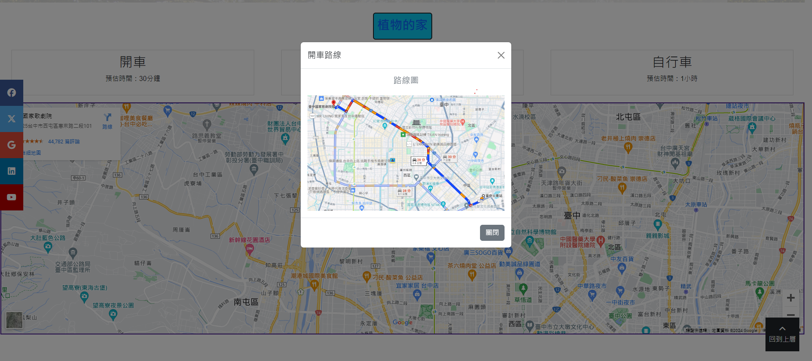
     
  2. #### 產品頁
     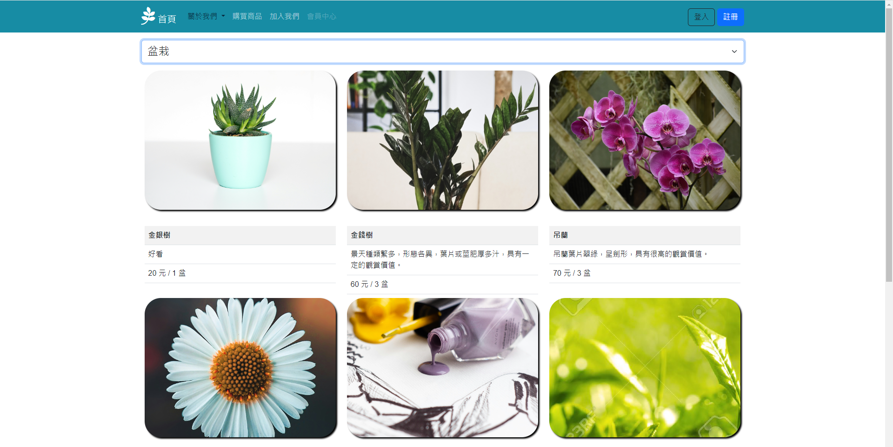
     
  3. #### 會員頁&登入註冊
     
     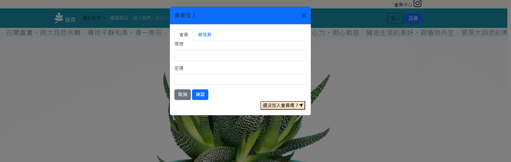
     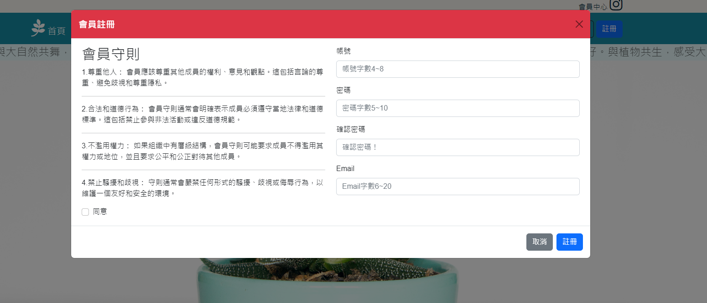

- ### 後台管理
  1. #### 登入
     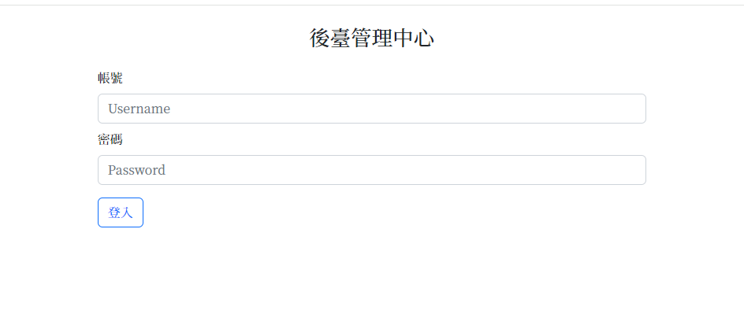
     
  2. #### 會員管理
     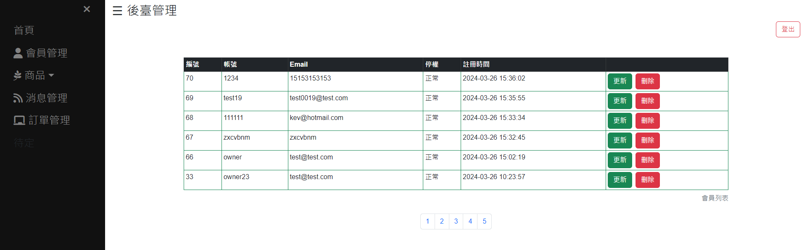
     
     
  3. #### 商品管理
     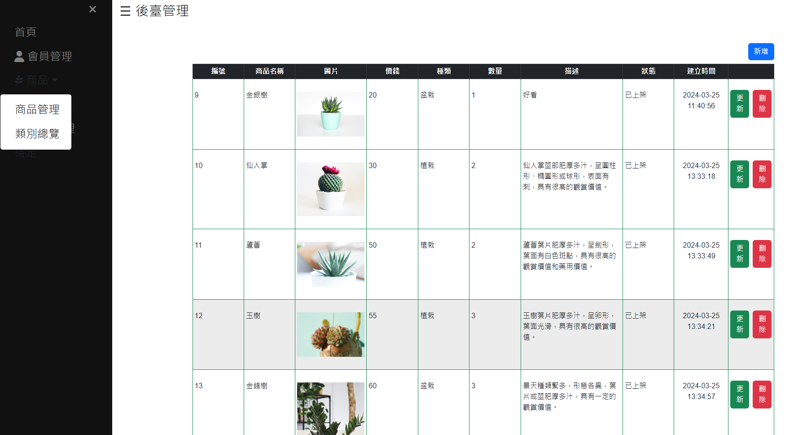
     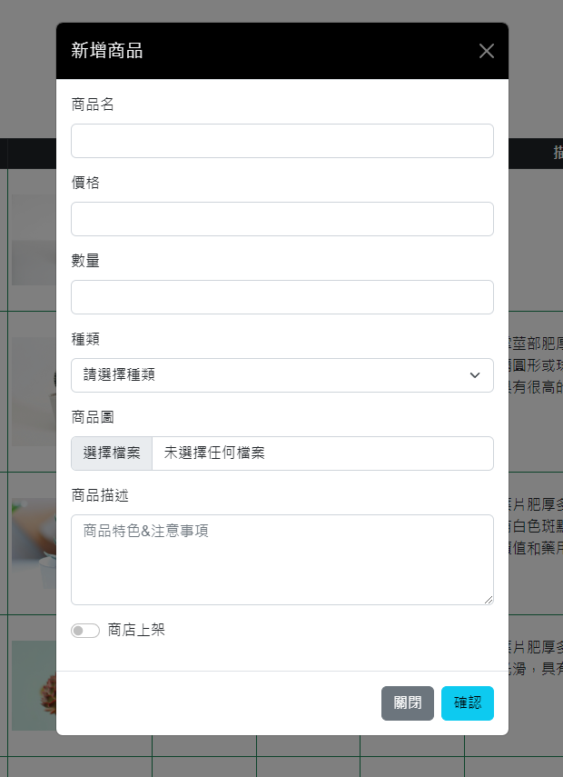
     
  4. #### 類別管理
     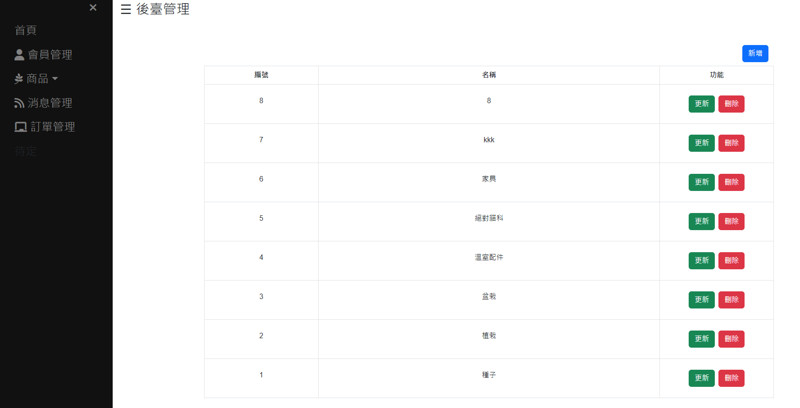
     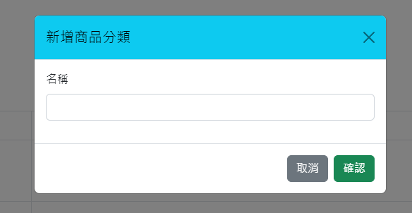
     
  5. #### 消息管理
     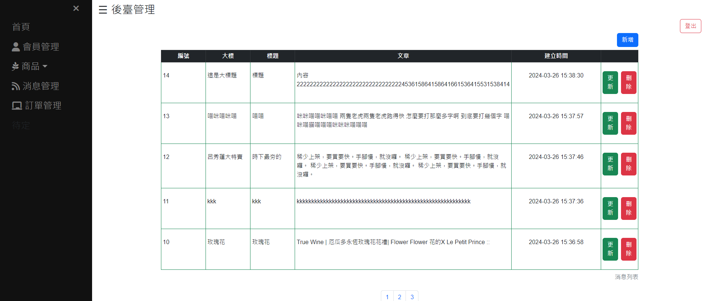
     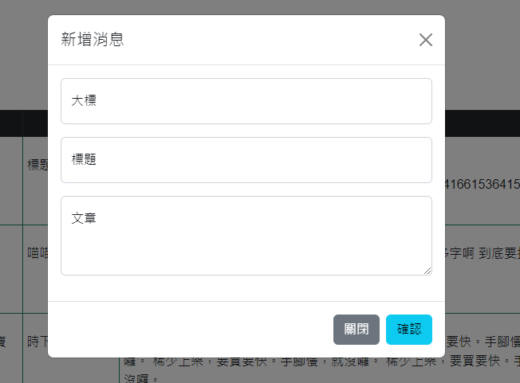
     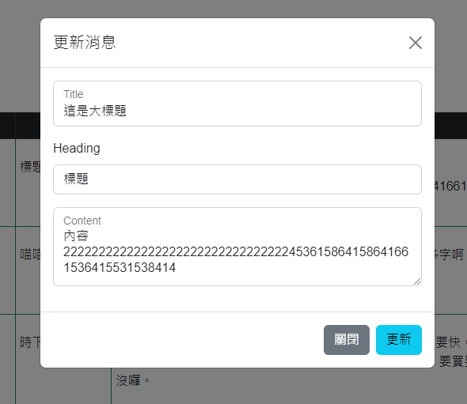

## 技術功能

- CSS/ Bootstrap v5.1.3
- HTML
- JS/ jQuery 3.7.1
- MySQL 4.1.3
- PHP 8
- JS/ sweetalert2

## 功能簡介

一頁式網站

- RWD響應式網站
- 會員登入系統
- 會員、商品、消息CRUD功能
- 前後台商品上架渲染
- 商品分類功能

## 第三方服務

- Google Map APi
- Chatgpt
...

## 聯絡作者

你可以透過以下方式與我聯絡

- zyuen0492@gmail.com
